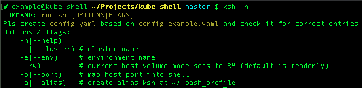

# Kube-shell

This is a set of Bash scripts aimed in help to connect / manage Kubernetes cluster using prepared Docker image. 
Useful, when you already have pre-built Docker images (e.g. deployer image for CI/CD), 
which already have injected `kubeconfig` files and installed special software like `Helm`. 
It can be stored at your container registry and pulled by CI/CD runner (e.g. GitLab runner). 

<details><summary>Example of deployer's Dockerfile</summary>
```shell script
FROM alpine:latest

ARG KUBECONFIG_FILE
ARG HELM_VERSION
ARG ENVIRONMENT
ARG LOCATION

ENV K8S_ENVIRONMENT=${ENVIRONMENT}
ENV K8S_LOCATION=${LOCATION}

RUN apk update && apk add curl && apk add --no-cache --virtual deps \
    bash \
    openssl

# Install kubectl
RUN curl -LO https://storage.googleapis.com/kubernetes-release/release/$(curl -s https://storage.googleapis.com/kubernetes-release/release/stable.txt)/bin/linux/amd64/kubectl && \
    chmod +x ./kubectl && \
    mv ./kubectl /usr/local/bin/kubectl

# Add kubectl config
RUN mkdir ~/.kube
COPY ./$KUBECONFIG_FILE /root/.kube/config

# Install helm
RUN curl https://raw.githubusercontent.com/helm/helm/master/scripts/get > ./get_helm.sh && \
    chmod 700 ./get_helm.sh && \
    ./get_helm.sh -v $HELM_VERSION

# Cleanup
RUN apk del deps && \
    rm get_helm.sh
```
</details>

### Install

- download files or `git clone https://github.com/demmonico/kube-shell.git`
- `cp config.example.yaml config.yaml`
- put your clusters at the `config.yaml` (see [Configuration section](#configuration))
- [optional] exec `./run.sh --alias <YOUR_ALIAS>` (suggested to use `ksh` as `<YOUR_ALIAS>`) for add to file `~/.bash_profile` the shortcut to runner
- [optional, needed if do step 2] reload shell


### Configuration

To configure your kube-shell put inside `config.yaml`:

```yaml
cluster_a:
  prod:
    pull_image: "deployer.your.container_repo/cluster_a:production"
  staging:
    pull_image: "deployer.your.container_repo/cluster_a:staging"
```

Sometimes deployer require for special token to generate personalised `kubeconfig` token. 
In that case you might be need to inject special environments variables into your deployer image. 
Then you can put them into `.env.super_secrets_for_cluster_a` file and add it to config:  

```yaml
cluster_a:
  prod:
    pull_image: "deployer.your.container_repo/cluster_a:production"
    env_file: ".env.super_secrets_for_cluster_a"
```

### Usage


##### Help

```shell script
ksh -h
```



##### Connect to k8s cluster

Connect to k8s `cluster_a` at `staging` environment (`staging` environment is default one)

```shell script
# short call
ksh -c cluster_a
 
# short call
ksh -c cluster_a -e staging
```

Connect to k8s `cluster_a` at `prod` environment

```shell script
ksh -c cluster_a -e prod
```

##### Operate at k8s cluster

When you get into deployer, you can see that entrypoint will change prompt message and add some shortcut aliases for k8s. 
Prompt message will look like `ksh::cluster_a/staging::/temp #` 

Available aliases you can check using `khelp`


For example, to list all pods from some namespace you can run `kg pod -n your_namespace`, 
or `kga -n your_namespace` to check such resources as `cronjob`, `job`, `pod`.  
Also, you might be interested in watching for pods or jobs lists, then just run `kwg -n your_namespace`, 
which is shortcut for `watch -n 5 kubectl get job,pod -n your_namespace` 

##### Mount volume from host

By default, it mounts current shell folder to container as `/temp` in `readonly` mode. 
To mount in `rw` mode just run `ksh` with option `--rw`.

```shell script
ksh --rw -c cluster_a
```

